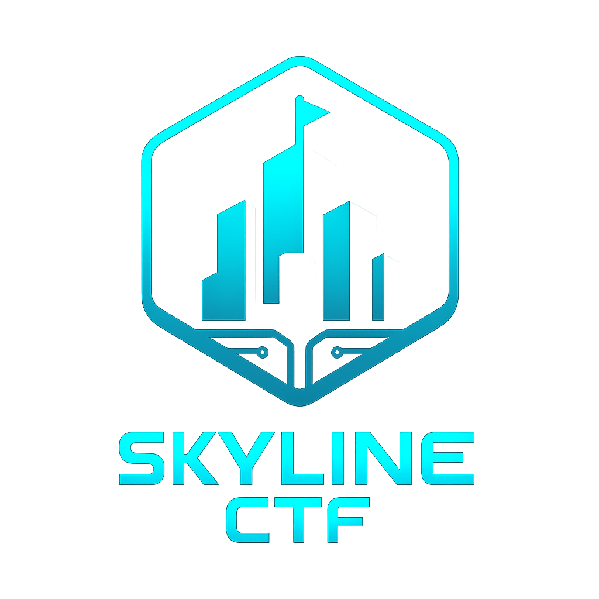
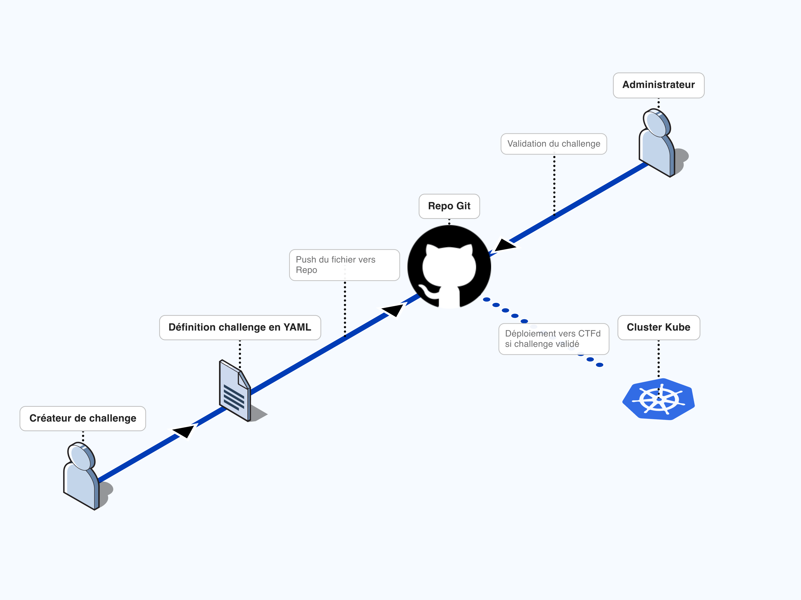
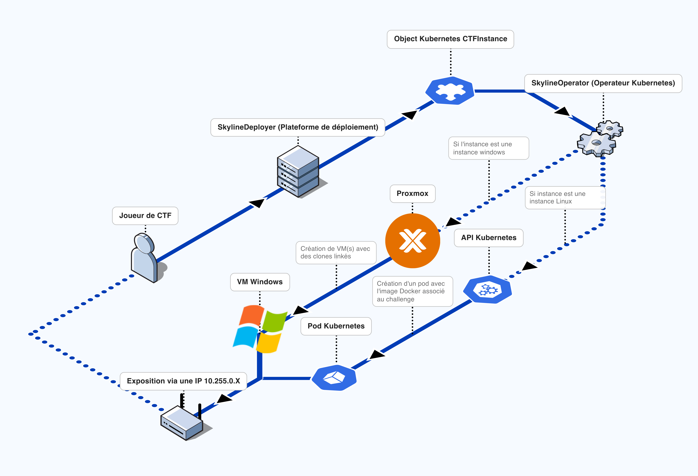

# SkylineCTF - Guide de Contribution 🏰



Bienvenue dans le dépôt des challenges SkylineCTF ! Ce guide vous expliquera comment créer, sécuriser et publier votre challenge sur la plateforme.

---

## 🚀 Comment ajouter un challenge ?

Suivez ces 4 étapes simples pour voir votre challenge en ligne.

### 1. Préparation 🛠️
Clonez ce dépôt sur votre machine et installez les dépendances nécessaires pour sécuriser vos fichiers.

```bash
git clone https://github.com/Sp00kySkelet0n/SkylineCTF-Challenges.git
cd SkylineCTF-Challenges
pip install python-gnupg # Requis pour le script de sécurité
# Assurez-vous aussi d'avoir 'sops' et 'gpg' installés sur votre système !
```

### 2. Création du Challenge 📝
Créez un dossier pour votre challenge (par exemple `Web/Mon-Challenge`).
Il doit contenir au minimum :
*   `Challenge.yaml` : La définition du challenge (points, description, image...).
*   `Dockerfile` : Pour construire l'environnement du challenge.
*   `src/` (Optionnel) : Votre code source.

**Exemple de `Challenge.yaml` :**
```yaml
apiVersion: skyline.local/v1
kind: CTFChallenge
metadata:
  name: mon-super-challenge
  namespace: ctfd
spec:
  name: "Le Hack du Siècle"
  description: "Pouvez-vous trouver le flag ?"
  category: "Web"
  points: 100
  image: "ghcr.io/sp00kyskelet0n/skylinectf-challenges/mon-super-challenge:latest"
  port: 80
  # flag: "SKL{mon_secret}" <-- ATTENTION : Voir étape 3 pour sécuriser ceci !
```

### 3. Sécurisation (Chiffrement) 🔐
**C'est l'étape la plus importante !** Protégez vos flags et votre code source en une seule commande grâce à notre assistant.

```bash
python3 manage_secrets.py secure Web/Mon-Challenge
```

L'assistant (`wizard`) va scanner votre dossier et :
1.  **Automatiquement** chiffrer le `Challenge.yaml` (Indispensable).
2.  **Automatiquement** chiffrer `WALKTHROUGH.md` s'il existe (Indispensable).
3.  Vous demander s'il faut chiffrer et zipper le dossier `src`.

**C'est tout !** Vos fichiers sont maintenant prêts.

### 4. Publication ✈️
Une fois vos fichiers sécurisés :

1.  Ajoutez vos fichiers (les versions chiffrées !) :
    ```bash
    git add Web/Mon-Challenge/Challenge.yaml
    git add Web/Mon-Challenge/src.zip.gpg
    git add Web/Mon-Challenge/Dockerfile
    ```
2.  Commitez et Pushez :
    ```bash
    git commit -m "feat: Ajout du challenge Mon-Super-Challenge"
    git push origin ma-branche
    ```
3.  Ouvrez une Pull Request. Une fois validée, Flux déploiera automatiquement votre challenge sur le cluster ! 🚀

---

## ℹ️ Fonctionnement Technique

### Infrastructure as Code (IoC)
SkylineCTF utilise une approche GitOps. Tout ce qui est sur la branche `main` est la vérité absolue du cluster.

### Déploiement Automatique
1.  **Flux** détecte les modifications.
2.  **SkylineOperator** lit votre `Challenge.yaml`.
3.  Le challenge est créé dans **CTFd** et déployé sur le cluster Kubernetes.

### Architecture


*Pour les instances à la demande (Pods/VMs) :*

